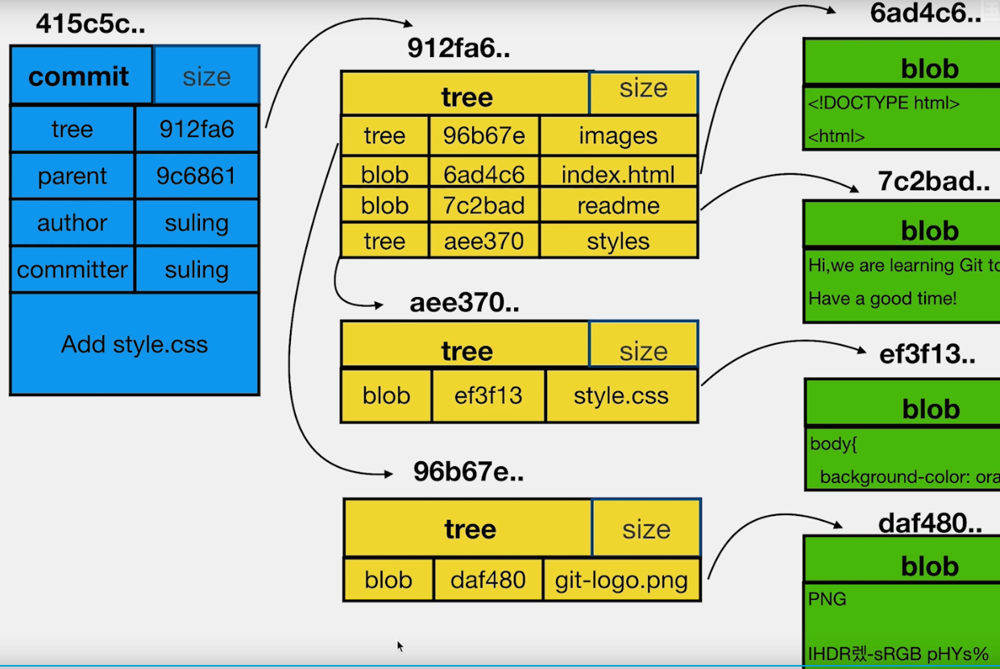
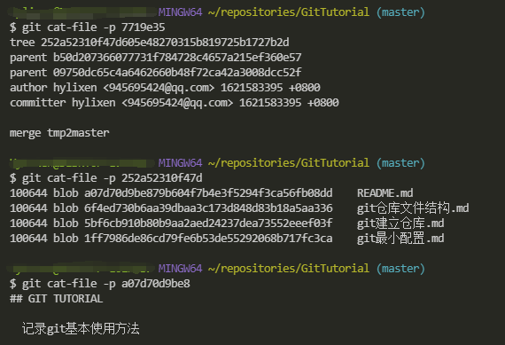

# Git仓库文件结构

* config  存放local配置
* HEAD  存放当前分支head
* refs  存放heads与tags
* logs  存放log
* objects  存储对象

使用git cat-file -t 查看对象类型，git主要有tree、commit、blob三种文件类型  

 </img>
 
使用git cat-file -p 查看对象内容  

 </img>
 
